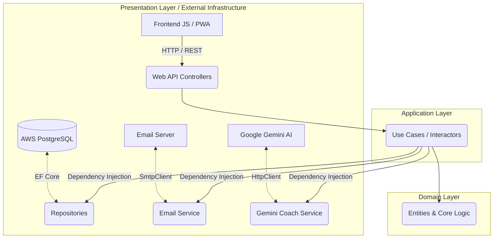

# SkillVault

    

**SkillVault** is a comprehensive platform designed for professionals and students to manage, track, and enhance their technical learning. It allows exact tracking of study hours, preparatory courses, and official certifications, all within a highly gamified environment powered by Artificial Intelligence.

---

## Key Features

*   **AI Coach (Gemini API):** Integration with Google Gemini (using the `gemini-flash-latest` model) to analyze the user's current courses and generate hyper-personalized study tips and practical mini-projects.
*   **Progressive Web App (PWA):** A fast, lightweight, and responsive interface that can be installed directly on a mobile device or desktop. It supports a **Demo Mode (Offline)** with mocked data if the servers are unavailable.
*   **Dark / Light Mode:** Persistent support for visual themes integrated into the design.
*   **Security and Authentication:** User system with secure login using **JSON Web Tokens (JWT)**.
*   **Background Services (Cron Jobs):** An automated reminder engine that evaluates user inactivity (every 24 hours) and sends emails (via SMTP) encouraging them to continue their courses.

## Technologies and Architecture

SkillVault was built applying best software engineering practices, governed by the principles of **Hexagonal Architecture (Ports & Adapters)** to ensure clean, testable, and scalable code.

### Tech Stack
*   **Backend:** C# with **.NET 10** (ASP.NET Core Web API).
*   **Database:** **PostgreSQL** hosted in the cloud (AWS RDS).
*   **ORM:** **Entity Framework Core** with a Code-First approach and automated migrations on startup.
*   **Frontend:** HTML5, CSS3 Variables, and Vanilla JavaScript (No heavy frameworks, 100% performance). Icons provided by *Lucide*.
*   **Artificial Intelligence:** Google Cloud Generative Language API (Gemini).
*   **Deployment (CI/CD):** **AWS Elastic Beanstalk** orchestrated with **Docker Compose** and an NGINX reverse proxy. Automated deployments via **GitHub Actions**.

### Architecture Diagram (Hexagonal)



## Installation and Local Setup

### Prerequisites
*   [.NET 10 SDK](https://dotnet.microsoft.com/download)
*   [PostgreSQL](https://www.postgresql.org/download/) (Optional if using Docker)
*   A valid Gemini API Key (`Gemini__ApiKey`)
*   SMTP Credentials (`EmailSettings__SmtpUser`, `EmailSettings__SmtpPass`)

### Steps
1. Clone the repository:
   ```bash
   git clone https://github.com/Colcolat/SkillVault.git
   cd SkillVault
   ```

2. Configure local secrets or environment variables. You can edit the `appsettings.json` locally in the `SkillVault` project and include your database connection string.

3. Restore dependencies and run the project:
   ```bash
   dotnet restore
   dotnet run --project SkillVault
   ```
   *Note: The application will run Entity Framework migrations automatically on startup, creating the necessary tables.*

4. Open the `index.html` file in your browser or start a static file server (Live Server) to access the frontend. If you run the API locally, make sure to update `API_BASE_URL` in `app.js`.

## Cloud Deployment on AWS

The project includes a `docker-compose.aws.yml` file specifically configured for multi-container environments on **AWS Elastic Beanstalk**.
The CI/CD pipeline packages the code automatically upon pushing to the `main` branch and securely exposes internal environment variables configured in the AWS console (Database, JWT Secret, Gemini API, SMTP) to the .NET container.
