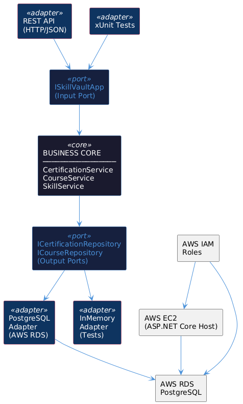

# ADR-001 · SkillVault: Certification & Learning Tracker

| | |
|---|---|
| **Author** | Juan José Zapata Buenfil |
| **Date** | 15/05/2026 |
| **Status** | Pending |

---

## Context

Developers in active training accumulate technical certifications across multiple platforms — HackerRank, AWS, Google, LinkedIn — with no centralized place to track, verify, or present their progress. The result is a fragmented view of professional growth that is hard to communicate in technical selection processes.

**SkillVault** is a web application that solves this by providing a single dashboard to register completed certifications, track courses in progress, and visualize growth over time by technical category (Cloud, Java, DevOps, SQL, etc.).

The system is built under the following constraints:
- **Language:** C# with ASP.NET Core, as required by the course
- **Infrastructure:** AWS (EC2 + RDS)
- **Timeline:** One semester 

---

## Decision

**Hexagonal Architecture (Ports & Adapters) deployed on AWS with PostgreSQL**

The business core is fully isolated from infrastructure concerns. It communicates exclusively through interfaces (**Ports**), whose concrete implementations (**Adapters**) are interchangeable without modifying domain logic.

```
INPUT ADAPTERS              BUSINESS CORE               OUTPUT ADAPTERS
─────────────────           ──────────────────────      ─────────────────────
REST API (HTTP/JSON)  ───►  CertificationService  ───►  PostgreSQL (AWS RDS)
xUnit Tests           ───►  CourseService         ───►  InMemory (Tests)
                            SkillService
```

The application is hosted on **AWS EC2 (t2.micro)**, with the database on **AWS RDS PostgreSQL**, and access secured through **AWS IAM Roles** — no hardcoded credentials.

### Why?

Hexagonal architecture was chosen because it directly solves the main risk of this project: building a system where business logic becomes tightly coupled to infrastructure as the project grows over the semester.

By defining `ICertificationRepository` and `ICourseRepository` as ports, the core never depends on PostgreSQL specifically — meaning the database adapter can be replaced by an in-memory adapter for testing without any changes to business logic. This is critical for writing meaningful xUnit tests later in the semester.

AWS was chosen over a local deployment because the project needs to be publicly accessible for demo and portfolio purposes, and because it reinforces the concepts being studied for the CLF-C02 exam (EC2, RDS, IAM, Free Tier) with real hands-on experience.

---

## Alternatives Considered

| Alternative | Why it was discarded |
|---|---|
| **Layered Architecture** | Couples business logic to infrastructure details. Replacing the database or adding new adapters would require modifying multiple layers. Hexagonal offers the same separation with better extensibility. |
| **Azure instead of AWS** | Equally valid as a cloud platform, but AWS was prioritized to reinforce my CLF-C02 exam concepts (EC2, RDS, IAM) with direct hands-on practice during the same learning period. |
| **MySQL instead of PostgreSQL** | MySQL is viable but PostgreSQL offers better support on AWS RDS, is more standard in enterprise environments, and is already the engine used in Applied Programming with Spring Boot — avoiding the overhead of learning two engines simultaneously. |


---

## Consequences

###  What is gained

- **Technical:** The business core is fully testable without any infrastructure. Replacing the database or adding a new adapter (e.g., an external API) requires no changes to domain logic.
- **Process:** Deploying on AWS from the start means the project is publicly accessible throughout the semester — not just for the final demo. Every commit goes through a CI pipeline that validates the system automatically.

### ⚠️ What is sacrificed or assumed

- **Technical limitation:** C# and AWS configuration must be learned simultaneously, which increases the initial setup time compared to a fully local solution.
- **Technical debt:** AWS Free Tier is limited to 750 hours/month per service. EC2 and RDS instances must be stopped when not in use to avoid unexpected charges after the free period ends.

---

## Diagram



> The PlantUML source for this diagram is versioned at `/docs/architecture.puml` and can be rendered at [plantuml.com](https://plantuml.com).

---

*Activity #08 — Software Architecture · Unit I · May–August 2026 · The creation of this readme was helped by Claude Sonnet* 
