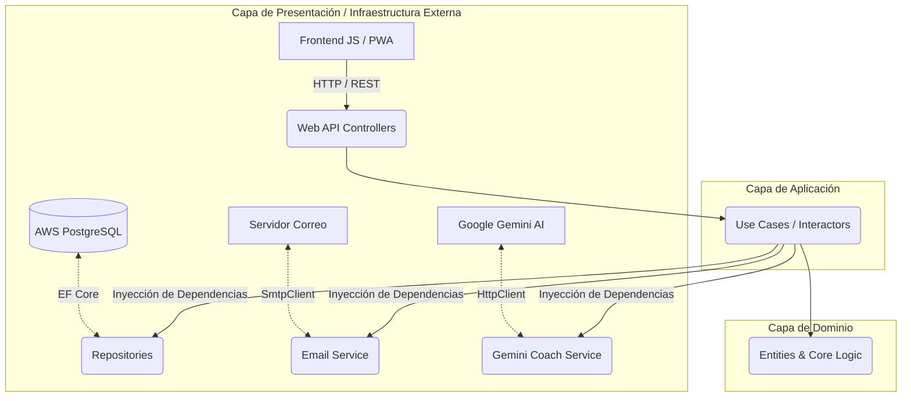

# 🚀 SkillVault

    

**SkillVault** es una plataforma integral diseñada para que profesionales y estudiantes gestionen, registren y potencien su aprendizaje técnico. Permite llevar un control exacto de horas de estudio, cursos preparatorios y certificaciones oficiales, todo bajo un entorno altamente gamificado y vitaminado con Inteligencia Artificial.

---

## ✨ Características Principales

*   🧠 **AI Coach (Gemini API):** Integración con Google Gemini (modelo `gemini-flash-latest`) para analizar los cursos actuales del usuario y generar consejos de estudio hiper-personalizados y proponer mini-proyectos prácticos.
*   📱 **Progressive Web App (PWA):** Interfaz rápida, ligera y adaptable que puede ser instalada directamente en el celular o escritorio. Soporta un **Modo Demo (Offline)** con datos mockeados si los servidores no están disponibles.
*   🌙 **Modo Claro / Oscuro:** Soporte persistente para temas visuales integrados en el diseño.
*   🔒 **Seguridad y Autenticación:** Sistema de usuarios con inicio de sesión seguro usando **JSON Web Tokens (JWT)**.
*   📧 **Servicios en Segundo Plano (Cron Jobs):** Motor de recordatorios automatizados que evalúa la inactividad del usuario (cada 24 hrs) y envía correos electrónicos (vía SMTP) invitándole a continuar sus cursos.

## 🛠️ Tecnologías y Arquitectura

SkillVault fue construido aplicando las mejores prácticas de ingeniería de software, rigiéndose bajo los principios de la **Arquitectura Hexagonal (Ports & Adapters)** para garantizar un código limpio, testeable y escalable.

### Stack Tecnológico
*   **Backend:** C# con **.NET 10** (ASP.NET Core Web API).
*   **Base de Datos:** **PostgreSQL** alojado en la nube (AWS RDS).
*   **ORM:** **Entity Framework Core** con enfoque Code-First y migraciones automatizadas al arrancar.
*   **Frontend:** HTML5, CSS3 Variables, y Vanilla JavaScript (Cero frameworks pesados, 100% rendimiento). Iconos proveídos por *Lucide*.
*   **Inteligencia Artificial:** Google Cloud Generative Language API (Gemini).
*   **Despliegue (CI/CD):** **AWS Elastic Beanstalk** orquestado con **Docker Compose** y un proxy inverso NGINX. Despliegues automatizados mediante **GitHub Actions**.

### Diagrama de Arquitectura (Hexagonal)



## 🚀 Instalación y Ejecución Local

### Prerrequisitos
*   [.NET 10 SDK](https://dotnet.microsoft.com/download)
*   [PostgreSQL](https://www.postgresql.org/download/) (Opcional si se usa Docker)
*   Una llave válida de Gemini API (`Gemini__ApiKey`)
*   Credenciales SMTP (`EmailSettings__SmtpUser`, `EmailSettings__SmtpPass`)

### Pasos
1. Clona el repositorio:
   ```bash
   git clone https://github.com/Colcolat/SkillVault.git
   cd SkillVault
   ```

2. Configura los secretos locales o variables de entorno. Puedes editar el `appsettings.json` localmente en el proyecto `SkillVault` e incluir tu cadena de conexión a la base de datos.

3. Restaura las dependencias y corre el proyecto:
   ```bash
   dotnet restore
   dotnet run --project SkillVault
   ```
   *Nota: La aplicación ejecutará las migraciones de Entity Framework automáticamente al arrancar, creando las tablas necesarias.*

4. Abre el archivo `index.html` en tu navegador o levanta un servidor de archivos estáticos (Live Server) para acceder al frontend. Si corres la API localmente, asegúrate de actualizar `API_BASE_URL` en `app.js`.

## ☁️ Despliegue en AWS

El proyecto incluye un archivo `docker-compose.aws.yml` configurado específicamente para entornos multi-contenedor en **AWS Elastic Beanstalk**. 
El flujo de CI/CD empaqueta el código automáticamente al hacer push a la rama `main` y expone internamente las variables de entorno configuradas en la consola de AWS (Base de datos, JWT Secret, Gemini API, SMTP) hacia el contenedor de .NET de manera segura.
