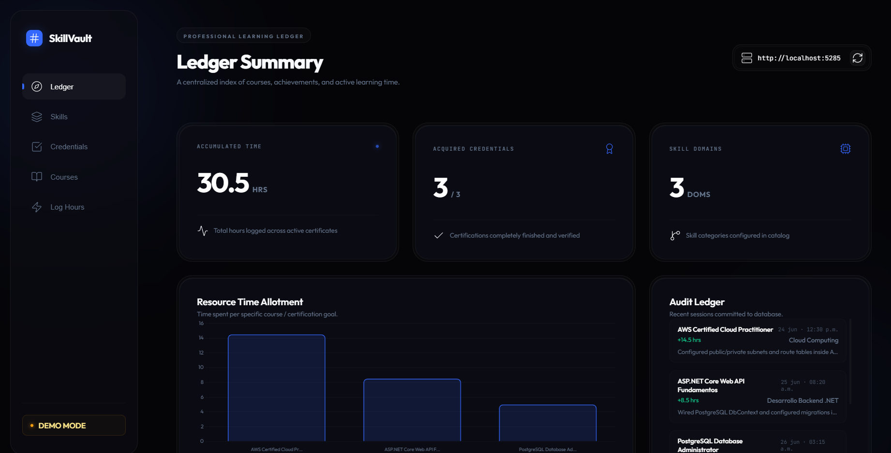

<p align="center">
  <h1>SkillVault</h1>
</p>

<p align="center">
  A centralized portfolio and learning log platform for professional developers.
</p>

<p align="center">
  <a href="docs/ADR-01">Cloud Architecture</a> ·
  <a href="docs/ADR-02">Design Views</a> ·
  <a href="docs/ADR-03">Hexagonal Pattern</a> ·
  <a href="docs/ADR-05">GoF Patterns</a>
</p>

<p align="center">
  <a href="https://github.com/Colcolat/SkillVault/stargazers"></a>
  <a href="https://dotnet.microsoft.com/"></a>
  <a href="https://www.postgresql.org/"></a>
</p>

<p align="center">
  
</p>

---

## What is SkillVault

SkillVault is an interactive web platform designed to centralize your technical certifications, track courses currently in progress, and log your daily study hours.

Instead of having your technical achievements fragmented across multiple learning platforms (such as AWS, HackerRank, Pluralsight, or Udemy), SkillVault consolidates your professional journey into a unified, auditable portfolio that demonstrates your real technical growth.

---

## Benefits

* **Professional Visibility:** Centralize and unify all your technical credentials in a dynamic portfolio, perfect for presenting during technical recruiting processes.
* **Learning Traceability:** Monitor and log the actual hours you dedicate to studying specific technologies, converting daily effort into quantifiable data.
* **Active Course Management:** Track the status of courses currently in progress, demonstrating continuous learning rather than just showcasing final certificates.
* **Adaptive Metrics:** Measure progress according to the nature of each milestone, whether by accumulating study hours or passing specific exams.

---

## Key Features

* **Dashboard Summary:** Real-time visualizations and charts of study hours, completed certifications, and pending targets.
* **Session Recorder:** Historical log to record study hours linked to a skill or course, allowing detailed notes and technical learning summaries.
* **Skills Catalog:** Group learning content by key categories (such as Cloud, Backend, SQL, or DevOps) to visualize individual progress percentages.
* **Credentials Manager:** Register certifications with verification links, providers, and completion dates.

---

## Getting Started

### Quick Setup

1. **Clone the repository:**
   ```bash
   git clone https://github.com/Colcolat/SkillVault.git
   cd SkillVault
   ```

2. **Configure the database:**
   Set up your local PostgreSQL connection string in `SkillVault/appsettings.json`.

3. **Run the application:**
   ```bash
   dotnet run --project SkillVault
   ```
   
4. **Access the client:**
   Open `SkillVault/frontend/index.html` directly in your browser and connect the local API URL.

---

## Star History

<a href="https://www.star-history.com/?repos=Colcolat%2FSkillVault&type=date&legend=bottom-right">
 <picture>
   <source media="(prefers-color-scheme: dark)" srcset="https://api.star-history.com/chart?repos=Colcolat/SkillVault&type=date&theme=dark&legend=bottom-right" />
   <source media="(prefers-color-scheme: light)" srcset="https://api.star-history.com/chart?repos=Colcolat/SkillVault&type=date&legend=bottom-right" />
   
 </picture>
</a>
