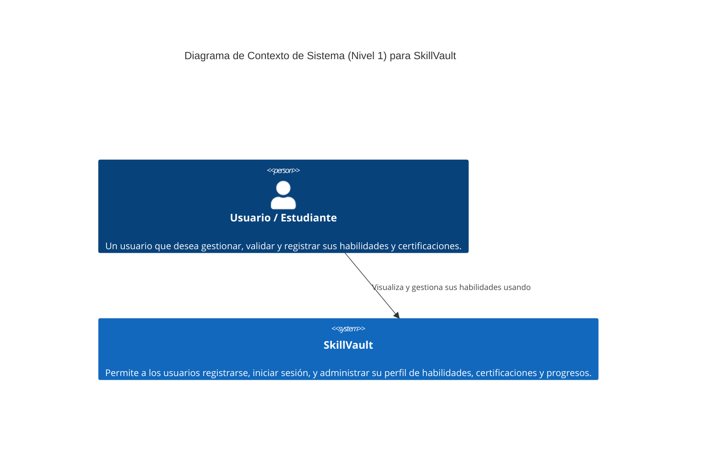
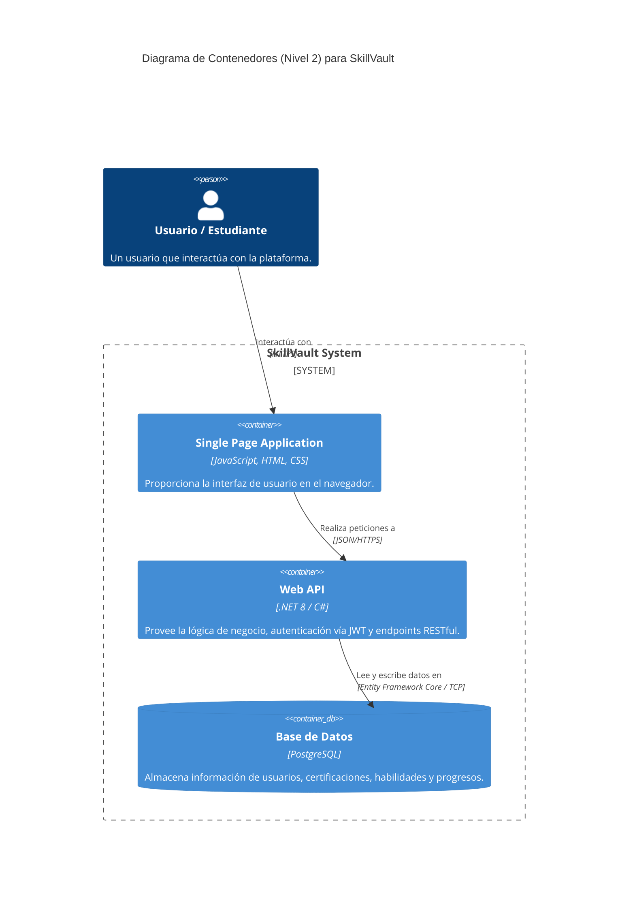
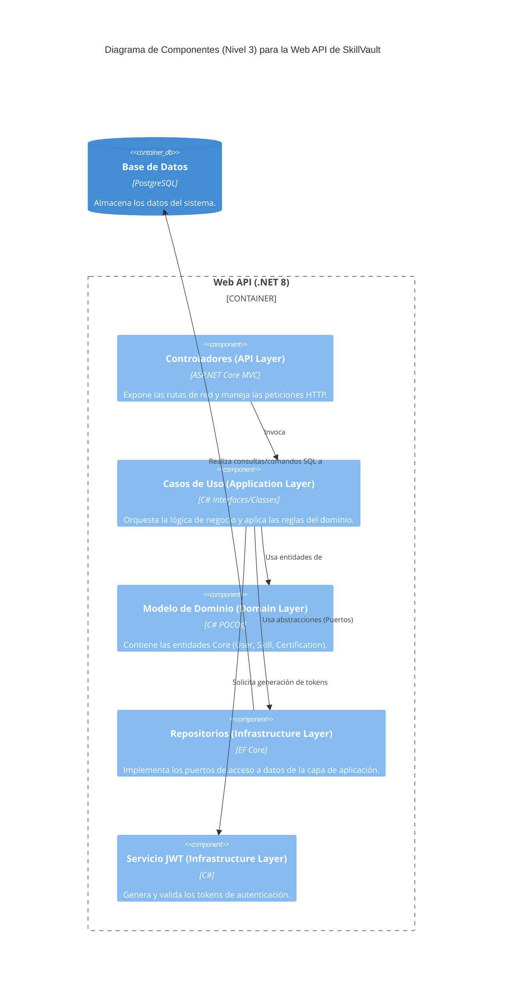

# Modelos C4 - SkillVault

A continuación se presentan los diagramas de arquitectura basados en el modelo C4 para el proyecto **SkillVault**.

## Nivel 1: Contexto del Sistema (System Context)

Muestra el sistema de software que estamos construyendo y cómo encaja en el mundo en términos de las personas que lo usan y los otros sistemas con los que interactúa.

## Nivel 2: Contenedores (Containers)

Hace zoom dentro del sistema para mostrar los contenedores (aplicaciones, bases de datos, etc.) que componen el sistema de software.

## Nivel 3: Componentes (Components)

Hace zoom dentro del contenedor principal (la Web API) para mostrar cómo está estructurado por dentro, basándose en la Arquitectura Limpia (Clean Architecture).

